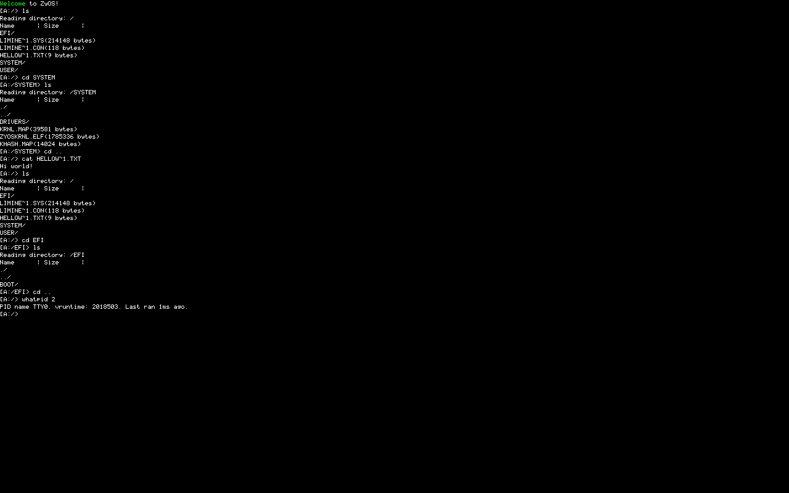

# ZyOS

A bare-metal, 64-bit Operating System written in C++ and AMD64 assembly.

It is a monolithic kernel architecture showcasing hardware initialization, memory management and other bits and trinkets.

## Screenshots

  
   
  <em>ZyOS in QEMU</em>

## Features & Architecture
* *Boot & Long Mode initialization*: The OS is booted via the Limine bootloader and placed in long mode.
* *Interrupt & Exception Handling*: The OS initialises the IDT to catch any exceptions, or interrupts generated by the CPU LAPIC timer. The OS also natively dissasembles itself IF a crash is generated. (This feature can be disabled in the kernel config header file)
* *Memory Management*: Physical & Virtual memory managers that handle allocation and free.
* *Kernel & Runtime*: Bare metal C++ with some custom libraries like sso strings and new support.

## Prerequisites
Ensure you have the following packages:
* Compiler: x86_64-elf-g++ and x86_64-elf-gcc
* Assembler: nasm
* Linker: x86_64-elf-ld
* ISO/image tools: mtools, limine, gptfdisk
* Other: python

## Setting up limine
To setup limine for this project, you must first download limine binaries for 10.3.2. You can get this [here](https://github.com/limine-bootloader/limine/tree/v10.3.2-binary).
You must the get the limine API, which can be downloaded [here](https://github.com/Limine-Bootloader/limine-protocol/blob/trunk/include/limine.h). You literally just need the header file. Then, take all those files and dump them into the limine/ directory in this project.

## Building & Running
* Clone via `git pull https://github.com/Zyperium/ZyOS.git`
* Set up limine (see above)
* Ensure you have all prerequisites
* Run `make` (optionally with `-j$(nproc)` to speed up compilation)
* Run `make disk` to ensure the disk image is generated
* Run `make run` to launch qemu against the made disk. This make run does check if you are on linux or windows before running the OS (if you are on windows you get whpx, but please note that this will not work on MacOS or BSD. You'll likely need to modify the launch arguments, or just boot it via qemu in the terminal.)

## Roadmap
- [x] Finish HAL setup
- [x] Implement LAPIC timers
- [x] Implement scheduler
- [x] Implement `kmo` loading (kernel modules)
- [x] Implement `zyx` loading (r3 applications)
- [x] Implement xHCI for USB mass storage support
- [ ] Fix xHCI for multiple devices (seems to break mass storage)
- [x] Basic syscall interface
- [ ] Comprehensive syscalls 
- [x] Good kernel libraries
- [ ] Ring 3 cstdlib & ported gnu compiler collection
- [ ] Display server (kernel module)
- [ ] Ring 3 compositor
- [x] Runtime code decompilation
- [ ] Stable multiprocessor support. (Very buggy)
- [x] Stable scheduler
- [ ] Discover the cause behind random race conditions during boot that either render the keyboard useless OR breaks `ls` and `sysload`
- [x] Fast file loading (very fast can load binaries in like 0.1s, boots in like 0.2s)

## License
This project is open source and available under the MIT License.